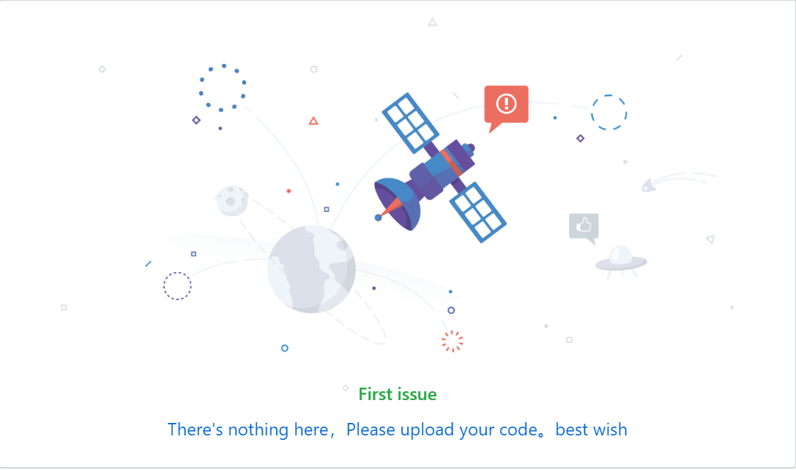
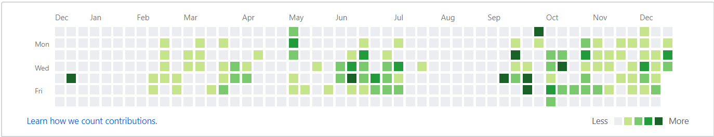

# A diligent little ant

> @ME: aijun.luo@outlook.com

- Github: https://github.com/luoaijun
- Package: [com.luoaijun](https://mvnrepository.com/search?q=luoaijun)

**Please follow the following licenses**
[GNU General Public License v3.0](https://github.com/luoaijun/com.cdes.blog/blob/master/LICENSE)

## Catalog
1. [Knowledge accumulation](Notes/chapter1.md): Technical notes
2. [MCP-Cloader](MCPLOADER/chapter2.md): Company project
3. [aiPool-Web](aiPoolWeb/chapter3.md): Subprojects in Personal Projects - Web Projects
4. [aiPool-SpiderSystem](Spider/chapter4.md): Subprojects in Personal Projects - SpiderSystem Projects
5. [aiPool-DataSystem](aiPooDataSystem/chapter5.md): Subprojects in Personal Projects - DataSystem Projects
6. [aiPool-DataAlgorithm](Algorithm/chapter6.md): Subprojects in Personal Projects - DataAlgorithm Projects
7. [aiPool-GDC](GDC/chapter9.md):  
8. [aiPool-GDC.View](GDCView/chapter10.md): 
9. [middleware-maven](mvn/chapter7.md): My jar package in the Maven central warehouse
10. [middleware-pypi](PyPi/chapter8.md):My jar package in the pypi
11. [Project-Demo case for data analysis
](demo/demo.md):Project-Demo case for data analysis

