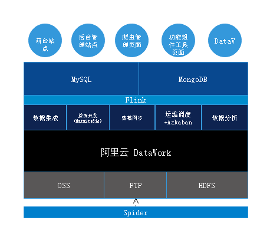

## aiPool - Data System
 
>Data Middlegroun

## What does it do?

### Aliyun DataWorks
> [Aliyun DataWorks](https://di2-cn-hangzhou.data.aliyun.com/?spm=a1z3jh.11711402.0.0.2c313413avEAll#/project/datasource-list)   [DataV](https://common-buy.aliyun.com/?commodityCode=datav#/)   [Flink](https://ci.apache.org/projects/flink/flink-docs-release-1.9/getting-started/tutorials/local_setup.html) **Mysql**   **Mongo**   **OSS**  **FTP**    [HDFS](https://www.aliyun.com/product/alidfs)

## Explain

