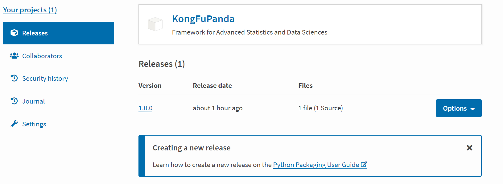
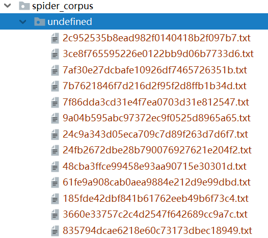
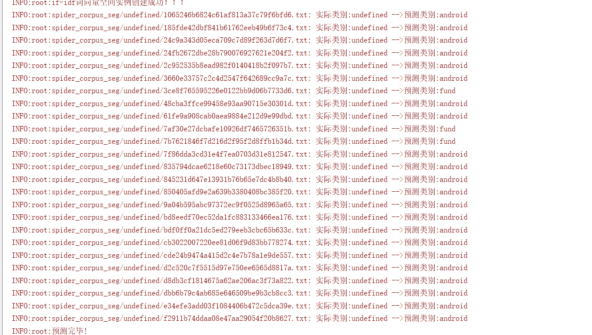

## PyPi-package

> [Push Your JAR to PyPi](https://luoaijun.github.io/note-book/#/chapter5/chapter5)

## Package-01：KongFuPanda

> Framework for Advanced Statistics and Data Sciences


###### Source code：[https://github.com/luoaijun/MachineLearning](https://github.com/luoaijun/MachineLearning)


###### Install

```
pip install KongFuPanda
```




## Package-01：ai-pool


> Framework for Advanced Statistics and Data Sciences


###### Source code：[https://github.com/luoaijun/com.luoaijun.data](https://github.com/luoaijun/com.luoaijun.data)


###### Install

```
pip install ai-pool
```
###### Example

**Process file**



**Coding：**
```
from aiPool.text_classification import TextClassification

if __name__ == '__main__':
    TextClassification.Classification().run("spider_corpus")

```

**Result**


